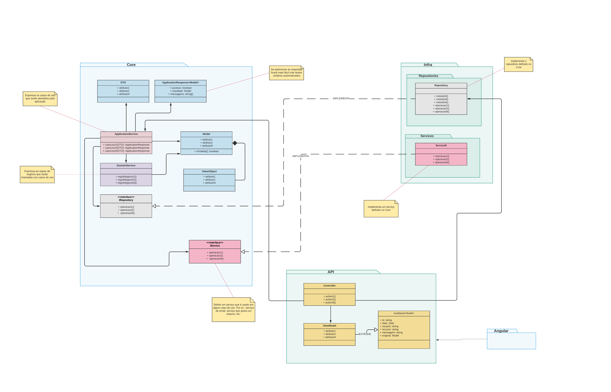

# Lab de Arquitetura - Core da Aplicação
Modelo de arquitetura para isolar as `regras de negócio` de uma aplicação.



## Application Services
Casos de usos


## Domain Services
Regras de negócio


## Model
Entidades do negócio


## Value Objects
Agregados


## DTO
Data transfer objects

## Builders
Ao invés de `criar instâncias de classes diretamente`, opte por usar métodos builders ou factories


## Interfaces
Sempre que precisar definir algo que seja provido fora do Core, use uma interface para expor os métodos que precisa. Assim pode implementar da forma que for apropriada sem criar dependências dentro do Core


# Datas no Node.JS/JavaScript


Gravar a data no formato GMT no banco de dados e converter no front end
para localidade desejada
```bash
new Date().toISOString({timeZone: "GMT"})
> '2022-06-24T10:18:05.147Z'
```

Data GMT para data da localidade desejada no Node.JS/javascript
```bash
new Date("2022-06-24T10:18:05.147Z").toLocaleString("pt-BR", {timeZone: "America/Sao_Paulo"})
> '24/06/2022 07:18:05'
```

Data para data GMT no Node.JS/javascript
```bash
new Date("2022-06-24T10:18:05").toLocaleString("pt-BR", {timeZone: "GMT"})
> '24/06/2022 13:18:05'
```

Data para data GMT formato ISO no Node.JS/javascript
```bash
new Date("2022-06-24T10:18:05").toISOString()
> '2022-06-24T13:18:05.000Z'
```